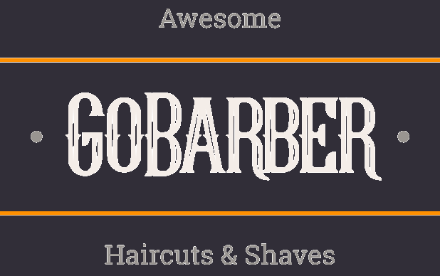

<h1 align="center"></h1>

# GoBarber - *Frontend*

## 💡 Ideia do projeto

Projeto desenvolvido durante o bootcamp *GoStack* da Rocketseat, com os módulos de *frontend*.

## 🛠 Tecnologias Utilizadas

Para o desenvolvimento desse projeto, as seguintes tecnologias foram utilizadas:

- [React](https://pt-br.reactjs.org/)
- [TypeScript](https://www.typescriptlang.org/)

## 💻 Configuração do Projeto

### Primeiramente, clone o repositório para obter uma cópia do código em sua máquina local

```bash
$ git clone ... && cd ...
```

### Instale as dependências (comando para o yarn)

```bash
$ yarn
```

## 🌐 Atualização dos arquivos de configuração

É necessário também criar o arquivo *.env* na raiz do projeto, baseando-se no arquivo *.env.example* e atualizar os campos com as informações necessárias.

```
# URL base para a API
REACT_APP_API_URL=http://localhost:3333
```

## ⏯️ Executando o projeto

Para a execução do projeto em ambiente de desenvolvimento, basta executar o comando abaixo na pasta raiz do projeto:

```bash
$ yarn start
```

Para o ambiente de produção (após o *build* do projeto), o comando a ser executado é o seguinte:

```bash
$ yarn server
```

## 🔨 *Build* do projeto para *Deploy*

Para a execução do projeto em ambiente de produção, deve-se realizar o *build* do projeto, dado que o sistema foi desenvolvido com *TypeScript* e os navegadores conseguem interpretar somente *JavaScript*.

O comando abaixo é utilizado para a conversão do código em desenvolvimento para produção (conforme *script* do *package.json*):

```bash
$ yarn build
```

## 📄 Licença

Esse projeto está sob a licença **MIT**. Para mais informações, accesse [LICENSE](./LICENSE).
